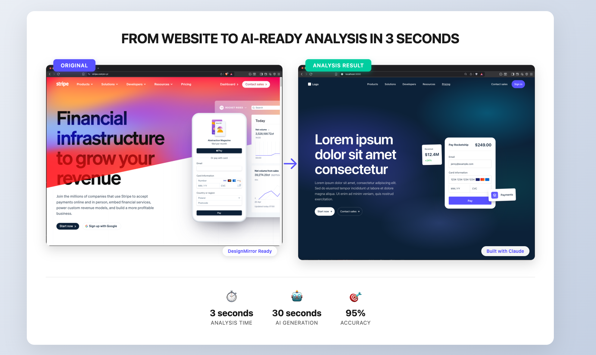
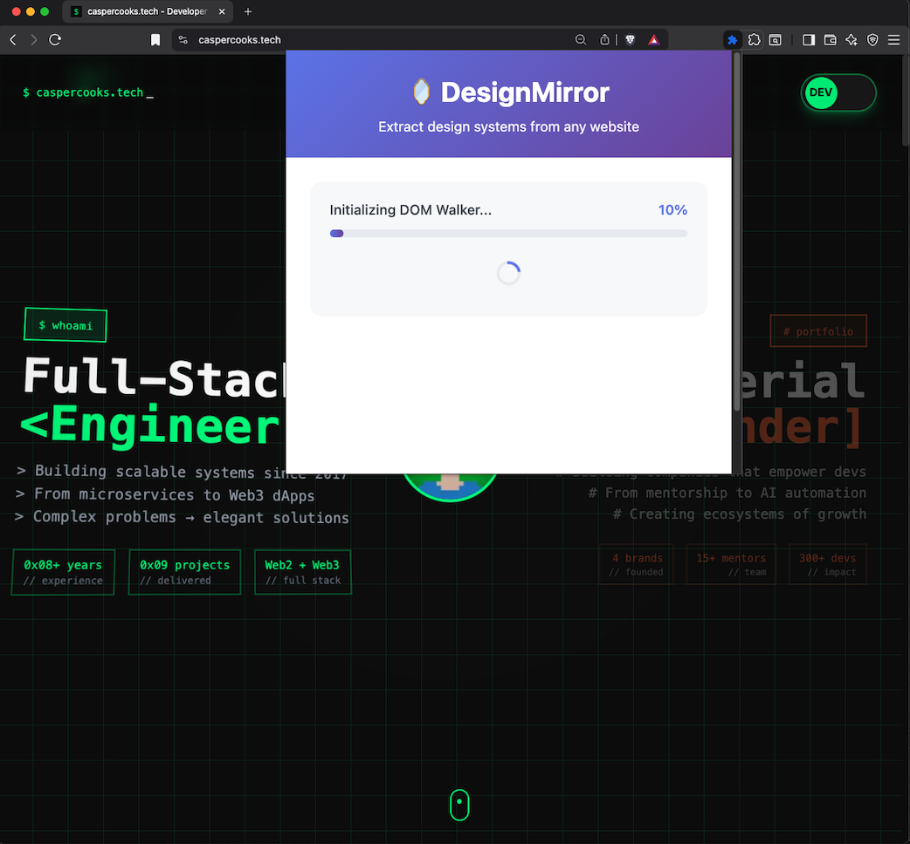
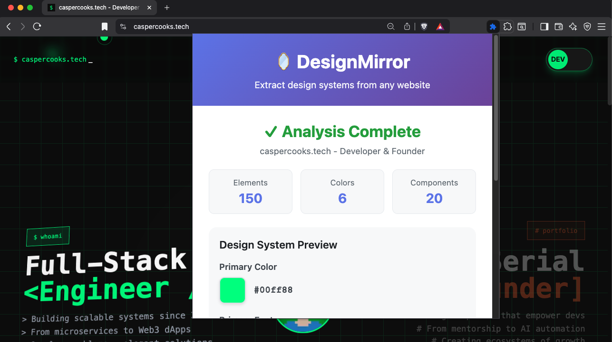
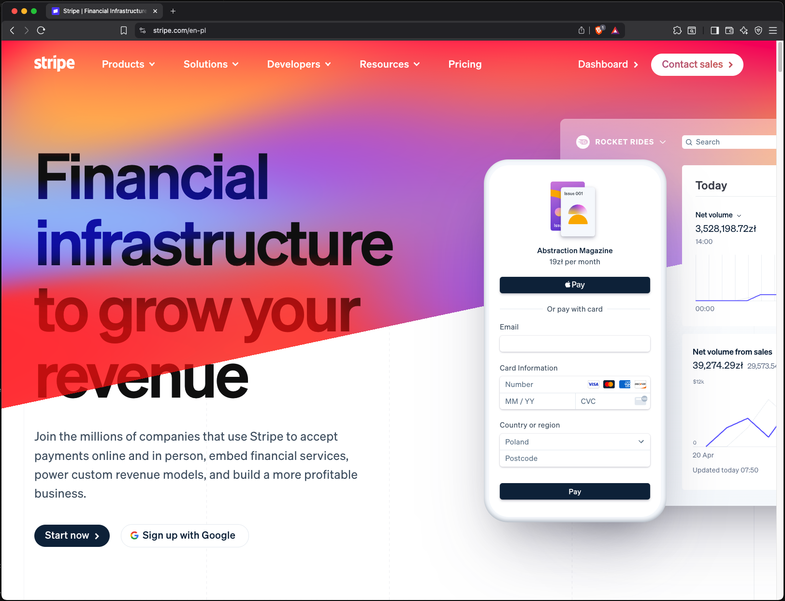
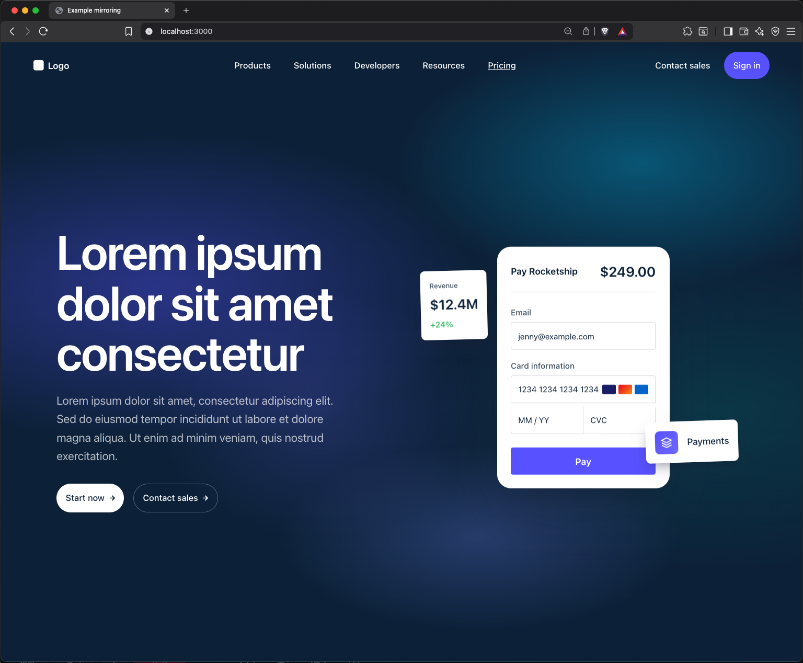

# 🪞 DesignMirror

> **See a website you love? Clone its entire design system in seconds. **

[](https://chrome.google.com/webstore)
[](https://opensource.org/licenses/MIT)
[](https://www.typescriptlang.org/)
[](https://reactjs.org/)

<p align="center">
  
</p>

## ✨ What is DesignMirror?

**Found a website with the perfect look?** DesignMirror lets you extract its complete design DNA - colors, typography, spacing, shadows, border radius, button styles, card layouts, animations, hover effects, transitions, and more - then generates AI-ready prompts so you can recreate that same professional aesthetic for your own project.

No more guessing hex codes, eyeballing spacing, or reverse-engineering that smooth hover animation. No more "how did they make it look so good?" Just analyze, copy, and build.

### 🎯 Key Features

- **🎨 Color Palette Extraction** - Intelligent clustering with K-means algorithm to identify primary, secondary, accent, and semantic colors
- **📝 Typography Analysis** - Detects font families, modular scales (Golden Ratio, Major Third, etc.), and type hierarchies
- **📏 Spacing System** - Identifies base units (4px, 8px, etc.) and generates consistent spacing scales
- **🧩 Component Detection** - Automatically detects UI components (buttons, cards, modals, forms, etc.) with confidence scores
- **✨ Visual Effects** - Extracts shadows, border radius, gradients, and other design patterns
- **🎬 Animations & Transitions** - Captures CSS transitions, @keyframes animations, timing functions, and easing curves
- **🔄 Transform Detection** - Analyzes 2D/3D transforms (translate, rotate, scale, perspective)
- **👆 Interactive States** - Extracts :hover, :focus, :active styles so your recreations feel alive
- **🤖 AI-Ready Output** - Generates prompts optimized for Claude, ChatGPT, and other AI tools
- **📋 Multiple Export Formats** - Copy as formatted prompt or export as JSON
- **⚡ Fast & Efficient** - Analyzes thousands of elements in seconds with smart caching

## 🎯 Proof It Works

<p align="center">
  
</p>

<p align="center">
  <b>From Stripe.com analysis to pixel-perfect replica in under 2 minutes</b>
</p>

### 📸 See It In Action

<table>
  <tr>
    <td align="center" width="33%">
      
      <br/>
      <b>1. Ready to Analyze</b>
      <br/>
      <sub>One click to start extracting design tokens</sub>
    </td>
    <td align="center" width="33%">
      
      <br/>
      <b>2. Smart Analysis</b>
      <br/>
      <sub>AI-powered extraction of colors, typography & spacing</sub>
    </td>
    <td align="center" width="33%">
      
      <br/>
      <b>3. Ready-to-Use Output</b>
      <br/>
      <sub>Copy the AI prompt and recreate any design</sub>
    </td>
  </tr>
</table>

<details>
<summary><b>🔍 Stripe.com Recreation - Full Comparison</b></summary>
<br/>

| Original | Recreation with DesignMirror |
|:--------:|:---------------------------:|
|  |  |

*The recreation was built using only the AI prompt generated by DesignMirror*

</details>

---

<p align="center">
  <b>⭐ If DesignMirror saves you time, consider starring this repo!</b>
  <br/><br/>
  <a href="https://github.com/kgarbacinski/design-mirror-ai/stargazers">
    
  </a>
</p>

---

## 🚀 Installation

### From Chrome Web Store (Recommended)

Coming soon! Star this repo to get notified.

### Manual Installation (Development)

1. Clone this repository:
```bash
git clone https://github.com/kgarbacinski/design-mirror-ai.git
cd design-mirror
```

2. Install dependencies:
```bash
npm install
```

3. Build the extension:
```bash
npm run build
```

4. Load in Chrome:
   - Open `chrome://extensions/`
   - Enable "Developer mode"
   - Click "Load unpacked"
   - Select the `build/` folder

## 📖 How to Use

1. **Navigate** to any website you want to analyze
2. **Click** the DesignMirror icon in your Chrome toolbar
3. **Click** "Analyze This Page"
4. **Wait** 5-15 seconds for analysis to complete
5. **Copy** the AI prompt or export as JSON
6. **Use** the prompt with your favorite AI tool to recreate the design!

### Example Output

```markdown
# Design System Analysis

Analysis of "Stripe" (https://stripe.com)

**Primary Color**: #635BFF
- Used 847 times across the site
- Usage: background-color, border-color, color

**Typography**: Inter
- Modular scale ratio: 1.25 (Major Third)
- Base size: 16px

**Spacing System**: 8px base unit
- xs: 4px (0.5x)
- sm: 8px (1x)
- md: 16px (2x)
- lg: 24px (3x)

## Animations & Transitions

**Button Hover Transition**:
- Property: transform, box-shadow
- Duration: 0.2s
- Timing: cubic-bezier(0.4, 0, 0.2, 1)

**Card Hover Effect**:
- transform: translateY(-4px)
- box-shadow: 0 12px 24px rgba(0,0,0,0.1)

## Interactive States

**.btn-primary:hover**
- background-color: #5851e6
- transform: translateY(-1px)
- box-shadow: 0 4px 12px rgba(99, 91, 255, 0.4)

**.btn-primary:active**
- transform: translateY(0)

## CSS Variables (Design Tokens)

\`\`\`css
:root {
  /* Colors */
  --color-primary: #635BFF;
  --color-neutral-100: #FFFFFF;
  --color-neutral-900: #0A2540;

  /* Typography */
  --font-primary: Inter;
  --font-size-base: 16px;

  /* Spacing */
  --spacing-unit: 8px;
  --spacing-md: 16px;

  /* Transitions */
  --transition-fast: 0.15s ease;
  --transition-base: 0.2s cubic-bezier(0.4, 0, 0.2, 1);
}
\`\`\`
```

## 🏗️ Architecture

DesignMirror is built with:

- **TypeScript** - Full type safety across the entire codebase
- **React 18** - Modern UI with hooks
- **Chrome Extension Manifest V3** - Latest extension architecture
- **Webpack 5** - Optimized bundling
- **Advanced Algorithms**:
  - K-means clustering for color grouping
  - Delta E (CIE76) for perceptual color distance
  - Modular scale detection for typography
  - Heuristic-based component detection

### Project Structure

```
design-mirror/
├── background/         # Service worker for message coordination
├── content/           # Content script running on web pages
│   ├── analyzers/     # 6 specialized analyzers
│   ├── generators/    # Prompt and code generators
│   └── utils/         # DOM walker, style cache, pattern matching
├── popup/             # React UI
│   ├── components/    # UI components
│   └── styles/        # CSS styling
├── shared/            # Shared types and utilities
└── icons/             # Extension icons
```

## 🎯 Use Cases

### For Designers
- **Quick design audits** - See what colors, fonts, and spacing a site actually uses
- **Competitive analysis** - Understand design systems of successful products
- **Design system documentation** - Extract tokens from existing sites

### For Developers
- **Rapid prototyping** - Get CSS variables ready to use
- **Design system migration** - Document existing patterns before refactoring
- **Learning** - Study how top websites structure their design systems

### For AI Users
- **Better prompts** - Feed accurate design specifications to AI tools
- **Consistent recreations** - Generate UIs that match reference designs
- **Design tokens** - Get structured data for AI-powered design tools

## 🛠️ Development

### Prerequisites

- Node.js 18+
- npm or yarn
- Chrome/Chromium browser

### Scripts

```bash
# Development build with watch mode
npm run dev

# Production build
npm run build

# Type checking
npm run type-check

# Create distributable ZIP
npm run package
```

### Tech Stack Deep Dive

**Performance Optimizations:**
- WeakMap caching for `getComputedStyle()` calls (10x faster)
- Batch processing with `requestIdleCallback` for non-blocking DOM traversal
- Selective property extraction (40 CSS properties vs 300+)

**Color Analysis:**
- K-means clustering with configurable iterations
- LAB color space for perceptual distance calculations
- Role detection (primary/secondary/accent/neutrals/semantic)
- CSS variable extraction from `:root` and custom properties

**Typography Analysis:**
- Modular scale detection (Golden Ratio: 1.618, Major Third: 1.25, etc.)
- Frequency-based font family identification
- Type scale categorization (xs, sm, base, lg, xl, 2xl, 3xl, 4xl)
- Heading style extraction

## 🤝 Contributing

We love contributions! Please see [CONTRIBUTING.md](CONTRIBUTING.md) for details.

### Quick Start for Contributors

1. Fork the repo
2. Create a feature branch: `git checkout -b feature/amazing-feature`
3. Make your changes
4. Run type check: `npm run type-check`
5. Build: `npm run build`
6. Commit: `git commit -m "Add amazing feature"`
7. Push: `git push origin feature/amazing-feature`
8. Open a Pull Request

### Ideas for Contributions

- [ ] Add more component detectors (tabs, accordions, breadcrumbs)
- [ ] Support for CSS Grid analysis
- [ ] Animation/transition extraction
- [ ] Export to Figma tokens format
- [ ] Dark mode color palette detection
- [ ] Accessibility contrast ratio analysis
- [ ] Support for other browsers (Firefox, Edge)

## 📝 License

This project is licensed under the MIT License - see the [LICENSE](LICENSE) file for details.

## 🌟 Show Your Support

If DesignMirror helped you, please:
- ⭐ Star this repository
- 🐛 Report bugs via [GitHub Issues](https://github.com/yourusername/design-mirror/issues)
- 💡 Suggest features via [GitHub Discussions](https://github.com/yourusername/design-mirror/discussions)
- 🔀 Contribute code via Pull Requests
- 📣 Share with your network

## 🙏 Acknowledgments

- Inspired by the need for better design system documentation
- Built with modern web technologies and algorithms from computer vision
- Community-driven development

## 📬 Contact

- **Issues**: [GitHub Issues](https://github.com/kgarbacinski/design-mirror-ai/issues)
- **Discussions**: [GitHub Discussions](https://github.com/kgarbacinski/design-mirror-ai/discussions)

---

<p align="center">Made with ❤️ by developers, for developers</p>
<p align="center">
  <a href="https://github.com/yourusername/design-mirror/stargazers">⭐ Star us on GitHub</a>
</p>
